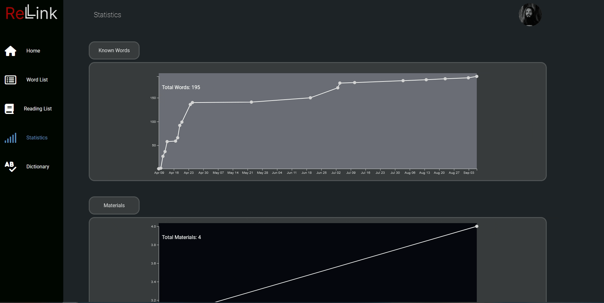

# Welcome to Relink!

Relink is an app that allows you to sign in with your Google account, import Chinese text into a reading list, and add words to a word list from the imported materials. Additionally, it lets you view statistics on how your vocabulary and reading list are growing.

##### Relink was built using the following technologies / Libraries:

    React
    React Router Dom
    Vite
    SCSS
    Node
    npm
    Express
    Mongoose
    MongoDB
    D3

Chinese word segmentation performed using [Jieba](https://github.com/fxsjy/jieba)

Getting Started

##### To get started with Relink, follow these steps:

- Clone the repository to your local machine.

- Install the dependencies by running `npm install`

- Run `cd server` then `npm run dev`

- Open another terminal window and `cd Relink` then `npm run dev`

- Open a third terminal window and `cd python` then `python app.py`

Navigate to http://localhost:5173 in your web browser.

### Usage

##### Import Chinese text into your reading list 📓

##### Add words to your word list from the imported materials 📜

##### Look up words in the dictionary. View statistics on how your vocabulary and reading list are growing 📈

#### License

Relink is licensed under the MIT License. See the LICENSE file for more information.
